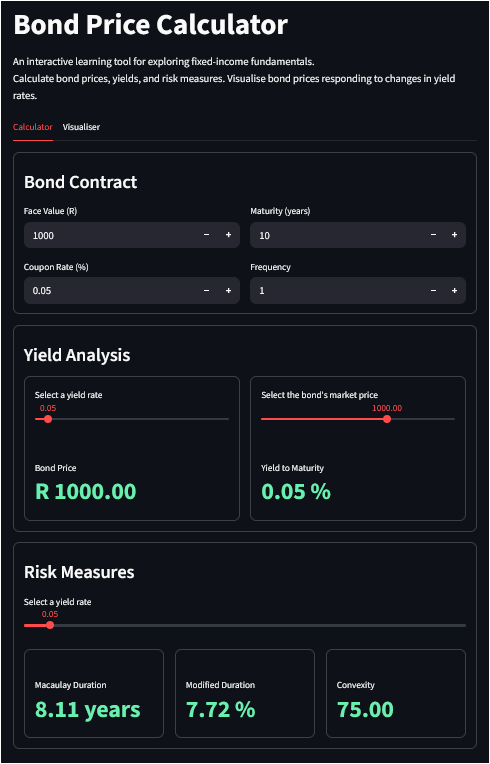
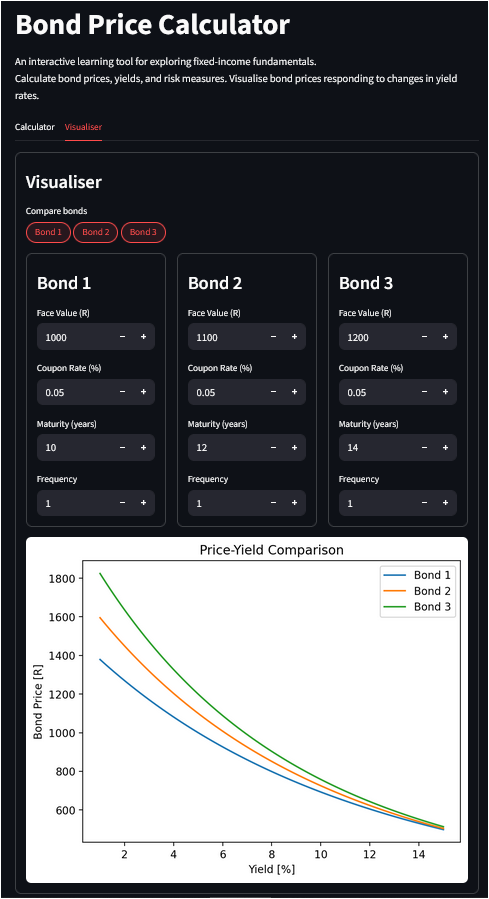

# Bond Price Calculator
An interactive learning tool for exploring fixed-income fundamentals.

## Overview
A basic calculator to price fixed-rate bonds.
Project uses a Streamlit app for visualisation and is intended to be used as a learning project.
Calculate bond prices, yields, macaulay duration, modified duration and the convexity of a bond.
Compare up to three bonds' prices for different yield rates.
Built with Python, NumPy, Matplotlib, and Streamlit.






## How to Run
```bash
git clone https://github.com/Alain-Source/bond_pricer.git
cd bond_pricer
python3 -m venv venv
source venv/bin/activate
pip install -r requirements.txt
```

**Command Line**
```bash
python3 main.py
```

**Interactive Web App**
```bash
streamlit run app.py
```

**Run Tests**
```bash
python3 test_bond.py
```

## Financial Theory

### Present Value
Present value is the value of a cash flow today that is set to be received sometime in the future.
The time value of money results in any future payment being worth less than the same value payment today.

### Bond Pricing
A fixed-rate bond is a debt instrument (loan) where an investor lends money to an issuer in return for regular interest (coupon) payments and in return for the principal amount (face value of the bond) at maturity. The bond's price is the present value of all of the future cash flows (both the coupon payments & principal value) which have been discounted at the required rate of return (yield rate).

### Yield-to-maturity
Yield to maturity (YTM) is the internal rate of return (IRR) which makes the present value of a bond's future cash flows equal to its current market price (not the face value). The bond's future cash flows include coupon payments and principal amount. There is no direct formula to solve yield to maturity for bonds with coupon payments. The project makes use of a numerical solution in the form of a bisection method.

### Macaulay duration
Macaulay duration is a formula which measures the interest rate sensitivity of a bond. It measures the weighted average time to receive the bond's cash flows. The weight of each cash flow is determined by dividing the present value of the cash flow by the bond's price. The higher the Macaulay duration, the more sensitive a bond's price is to changes in yield rates.

### Modified duration
Modified duration builds on Macaulay duration and is used to approximate the percentage change in a bond's price based on a 1% change in yield rates.

### Convexity
Convexity is the rate at which the duration of a bond changes as the yield rate changes. 
Where duration is a linear approximation of bond prices changing based on yield rate changes, convexity is the measure of the curvature of that relationship or the duration's rate of change. Convexity improves the duration measure's approximation for larger yield rate changes. 
Convexity is used to analyse the risk and reward relationship in purchasing a bond.


## Project Structure

```
bond_pricer/
├── bond.py          Bond class — pricing, YTM, duration, convexity
├── main.py          CLI testing script
├── app.py           Streamlit interactive web app & primary means of using the calculator
├── test_bond.py     Unit tests for Bond class
├── requirements.txt Python dependencies
└── README.md        Project documentation
```

## Testing
Tests cover two areas:
- **Input validation** — confirms that input handling (negative values, non-integer maturity, unsupported frequencies) does throw an error in the Bond Class
- **Calculation accuracy** — confirms that pricing, YTM, duration, and convexity are correctly calculated and checks results against known analytical results (par bond pricing, zero-coupon duration, price-yield relationship)

Run with `python3 test_bond.py`


## What I Learned & Next Steps
Learned how to structure a Python project to separate business logic (Bond class) from the user interface (Streamlit app). 
Implemented a bisection method to solve the YTM of a bond based on its market price. Built unit tests in Python to verify input handling and calculation accuracy for the first time.

On the financial side, gained a deeper understanding of how duration and convexity are used together to describe a bond's yield rate sensitivity.
Higher convexity is always desirable - when yields rise, the bond's price falls less than a lower convexity equivalent, while falling yields cause the price to rise further.

Next steps include building a more realistic yield curve from market data, and adding day count conventions.
A further extension would be implementing the Vasicek interest rate model to simulate bond prices under random interest rate movements which would transform the project from a calculator into a stochastic simulation.

## License
This project is licensed under the MIT License — see the [LICENSE](LICENSE) file for details.